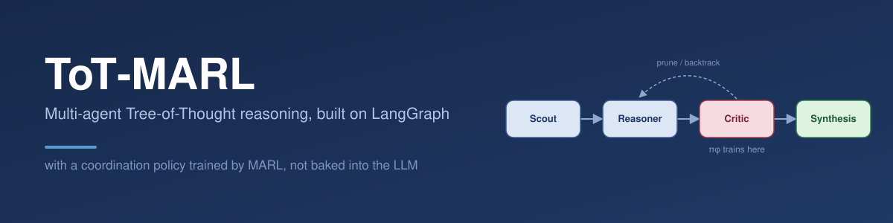
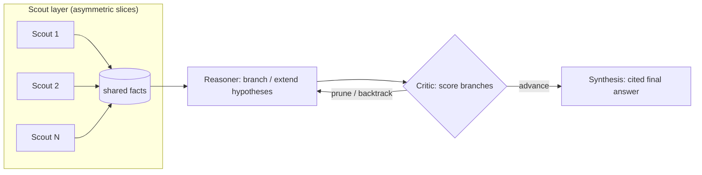

<p align="center">
  
</p>

<p align="center">
  <a href="LICENSE"></a>
  
  
</p>

A multi-agent reasoning system where a **Scout** layer reads asymmetric slices of a
text corpus, a **Reasoner** layer explores competing hypotheses (Tree-of-Thought),
and a **Critic** decides when to prune, backtrack, or advance to **Synthesis**.

What makes this different from a normal agent pipeline: the Critic's routing
decision is built to be swapped out for a policy trained with Multi-Agent
Reinforcement Learning (MAPPO / GRPO), while the underlying LLM stays frozen.
The full design rationale — why this shape, why this reward function, why the
first target task is legal precedent reasoning — lives in
**[`docs/BLUEPRINT.md`](docs/BLUEPRINT.md)**. This README is the quickstart;
that doc is the "why."

## How it fits together



The Critic's box is the one piece meant to change over time: today it's a
prompted LLM call (`LLMRouter`), and the whole point of the repo is to replace
it with a trained `LearnedRouter` (`\pi_\phi`) without touching anything else —
see [`tot_marl/policy/router.py`](tot_marl/policy/router.py).

## Repo layout

```
tot-marl/
├── docs/
│   ├── BLUEPRINT.md          # full design doc: architecture, eval axes, RL framework
│   └── banner.svg
├── tot_marl/
│   ├── state.py              # GraphState - the shared blackboard schema
│   ├── memory.py             # reducers (branch merge-by-id, etc.)
│   ├── schemas.py             # structured-output schemas the LLM is forced to fill in
│   ├── llm.py                 # single place every node gets its model client from
│   ├── graph.py              # wires the pipeline above
│   ├── nodes/
│   │   ├── scout.py          # Send fan-out over asymmetric slices + extraction prompt
│   │   ├── reasoner.py       # Send fan-out over ToT branches + hypothesis prompts
│   │   ├── critic.py         # the pi_phi swap point
│   │   └── synthesis.py      # terminal node, never sees raw scout text
│   └── policy/
│       ├── router.py         # RoutingPolicy interface: LLMRouter today, LearnedRouter later
│       └── reward.py         # R_total = R_task + R_efficiency + R_consensus
├── eval/
│   ├── metrics.py            # Evaluation Point 1 & 2 metric stubs
│   └── run_pilot.py          # `python -m eval.run_pilot`
├── data/pilot_cases/          # one example case now, real pilot set later
└── tests/
    ├── test_graph_structure.py  # graph compiles + wires correctly, no model calls
    ├── test_router_unit.py      # pure helper-function checks, no model calls
    └── test_graph_smoke.py      # real end-to-end run - needs ANTHROPIC_API_KEY, else skipped
```

## Quickstart

```bash
git clone <this-repo-url> && cd tot-marl
pip install -r requirements.txt
cp .env.example .env   # fill in ANTHROPIC_API_KEY - every node calls a real model now

python -m eval.run_pilot   # runs the example case end-to-end, prints the result
pytest                      # structure + unit tests always run; the real e2e
                             # test also runs if ANTHROPIC_API_KEY is set, else skips
```

Every node now makes a real, structured-output call to Claude (`scout_node`,
`reasoner_node`, `LLMRouter.decide`, `synthesis_node`) - see
[`tot_marl/schemas.py`](tot_marl/schemas.py) for exactly what each one is
forced to return, and [`tot_marl/llm.py`](tot_marl/llm.py) for the one place
the model client is configured. The **graph wiring** was proven separately
and first (Send-based fan-out for scouts, Send-based fan-out for ToT
branches, branch extension across depths, a hard depth cap, a rollout log)
before any prompt was written - that's why `tests/test_graph_structure.py`
stays model-call-free: it's still worth being able to check the wiring alone
didn't break, without spending a token.

## Status

- [x] Graph compiles and runs end-to-end (stub logic, no model calls)
- [x] ToT branch fan-out, extension, and backtrack loop verified
- [x] Real prompts for Scout / Reasoner / Critic / Synthesis (structured output via `tot_marl/schemas.py`)
- [ ] Run against a real pilot case and sanity-check the output by hand
- [ ] Evaluation Point 1 & 2 metrics (`eval/metrics.py`) implemented against a real pilot set
- [ ] `pi_phi` training loop (MAPPO/GRPO) wired to `policy/reward.py`

See `docs/BLUEPRINT.md` for the reasoning behind each of these and what's next.

## License

MIT — see [`LICENSE`](LICENSE).
