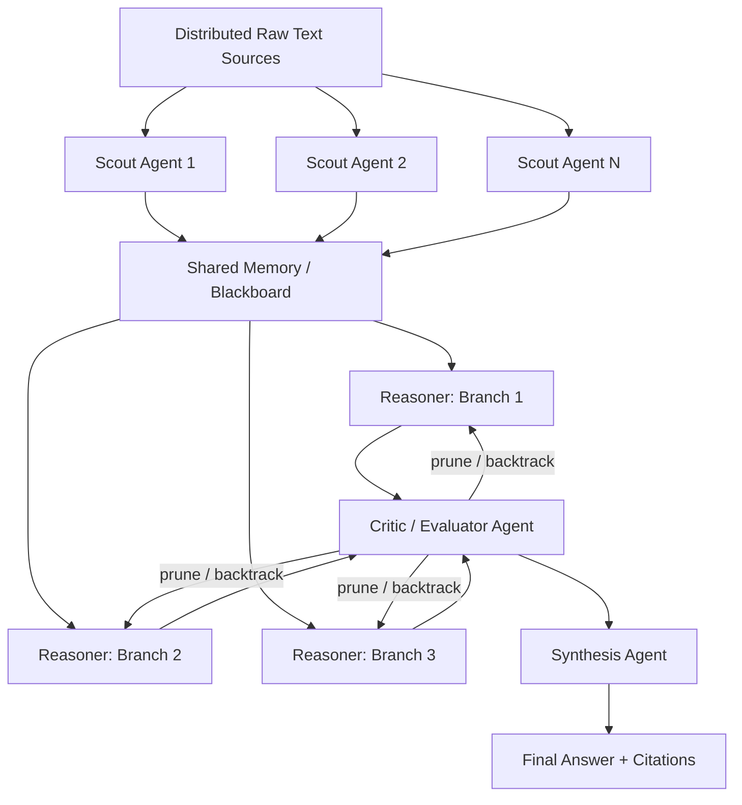
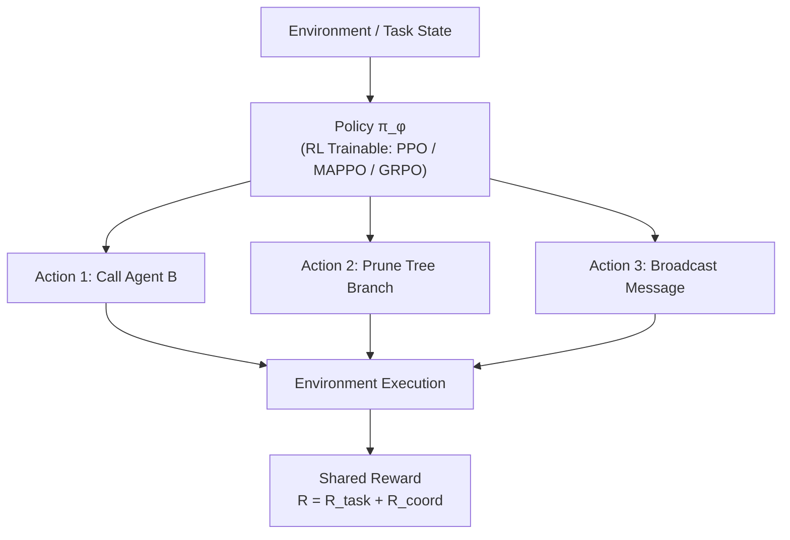

# Multi-Agent Tree-of-Thought Reasoning Framework — Project Blueprint

**Status:** Draft for team review
**Last updated:** September 2026

---

## 1. Purpose

We are building an agentic framework (ReAct-style tool use, extended with Tree-of-Thought search) to study two things at once:

1. **Task performance** — can a team of agents correctly process a large, messy body of text and arrive at a well-supported decision?
2. **Cooperation quality** — do the agents actually collaborate well (share the right information, resolve conflicts, avoid redundant work), independent of whether the final answer is right?

This document records the system architecture, the evaluation design, and — the open question we're resolving now — **which reasoning task/domain to build the benchmark around.**

---

## 2. System Architecture

### Agent roles

| Role | Count | Responsibility |
|---|---|---|
| **Scout / Extraction agents** | 3–5 | Each owns a distinct, non-overlapping slice of the raw text corpus. Extracts claims/facts and posts them to shared memory. **Deliberately given asymmetric information** — no single scout can solve the task alone. |
| **Reasoner agents** | 2–3 | Generate competing hypotheses (tree branches) from what's in shared memory. Extend, revise, or abandon branches as new evidence arrives. |
| **Critic / Evaluator agent** | 1 | Scores each branch (e.g., Supported / Uncertain / Contradicted), decides where to keep searching vs. prune, and can send reasoners back to re-derive a branch. |
| **Synthesis agent** | 1 | Has no raw documents — only what's been reported to it. Merges the winning branch into a final, cited answer. Also the natural point to check for information loss during hand-off. |

This role split is what makes cooperation *load-bearing*: if scouts don't communicate accurately, or the synthesizer misreads what reasoners actually agreed on, the system provably fails — cooperation isn't decorative.

---

## 3. Evaluation Framework

### Evaluation Point 1 — Task Performance ("did they get it right?")

| Metric | What it captures |
|---|---|
| Factual grounding rate | % of claims in the final answer traceable to real source text (vs. hallucinated) |
| Citation accuracy | Are cited sources actually on-point, not just present |
| Branch pruning accuracy | Did the Critic correctly kill bad branches early, or waste turns on dead ends |
| Path optimization | Does the selected branch beat a Chain-of-Thought (single-agent, no tree) baseline |
| Calibration | Stated confidence vs. actual correctness |
| Distractor robustness | Performance when extra red herrings / irrelevant documents are injected |
| Efficiency | Tool calls / tokens / turns to a correct, well-cited answer |

### Evaluation Point 2 — Cooperation Quality ("did they work well together?")

| Metric | What it captures |
|---|---|
| Consensus reachability | Turns needed for scouts to agree on extracted facts / for reasoners to converge on a branch |
| Information asymmetry resolution | When two agents hold conflicting or complementary facts, do they surface and resolve the conflict, or does one silently overwrite the other |
| Communication signal-to-noise | Useful facts exchanged vs. pure coordination chatter |
| Correction ability | If one agent is seeded as confidently wrong, does the group catch it, and how much evidence does it take |
| Synthesis fidelity | Does the final answer actually reflect what specialists reported, or does information get lost/distorted at hand-off |
| Token/communication overhead vs. single agent | Cost of coordination relative to any accuracy gain it buys |

**Design principle:** every cooperation metric above should have a corresponding *injected* test condition (a seeded conflict, a seeded wrong agent, a held-back fact) so the metric isn't just descriptive — it's actually being tested.

---

## 4. Candidate Problem Domains

The task needs: (a) large volumes of real text, (b) natural multi-hypothesis branching, (c) a way to split information across agents so cooperation is required, and (d) — ideally — **ground truth that already exists**, so we're not stuck hand-authoring correct answers.

### 4.1 Primary candidate: Legal research & precedent reasoning

Legal reasoning is close to an ideal fit: it's adversarial by nature (two sides read the same facts differently — free information asymmetry), it branches into competing theories, it depends on citation accuracy (easy to score), and — critically — **outcomes are already decided and public**, so ground truth requires no authoring.

**Open data sources**

| Source | What it has | Access | Notes |
|---|---|---|---|
| [CourtListener](https://www.courtlistener.com) (Free Law Project) | ~8–9M US court opinions (SCOTUS, all circuits, state high/appellate courts), RECAP federal docket archive, oral argument audio, judge bios, a citation graph, and a **citation-lookup API** that validates citations against real case law | REST API v4 (`api/rest/v4/`), token auth | Current version is REST API v4.4, base URL `https://www.courtlistener.com/api/rest/v4/`, with token-based auth on every request. As of 2026 the free tier dropped to 5 requests/minute, 50/hour, 125/day (down from a much higher prior default) — a free academic membership raises this. The citation-lookup endpoint parses every citation in a block of text and checks it against CourtListener's database as a guardrail against hallucinated citations — i.e., it can *automatically score* whether an agent's cited case law is real, which is directly useful for Evaluation Point 1. |
| [Congress.gov API](https://api.congress.gov) | Bill text (all versions), amendments, actions, committee reports, sponsors, summaries | REST API v3, free key via api.data.gov | 5,000 requests/hour rate limit, results paginated up to 250 per call. Good for legislative-history tasks. (Note: the older ProPublica Congress API is defunct — don't build against it.) |
| [GovInfo.gov](https://www.govinfo.gov) | Full text of the US Code, CFR, Federal Register, Congressional Record, public/private laws, bulk bill-status XML | Bulk data + API | Complements Congress.gov for statutory text and legislative history. |
| [Caselaw Access Project data via CourtListener](https://www.courtlistener.com) | Harvard's historical case-law corpus; the standalone case.law project has been folded into CourtListener's holdings | Same CourtListener API | Treat as one corpus with CourtListener now, not a separate source. |
| [Oyez.org](https://www.oyez.org) | SCOTUS oral argument audio + case abstracts | Scrape/API (unofficial) | Nice for a "listen to argument, predict ruling" variant later. |

**Task designs (pick one to start, others as stretch goals)**

1. **Precedent prediction with citation grounding.** Give agents the fact pattern and legal question of an *already-decided* case (holding withheld). Scouts search CourtListener for candidate precedents; reasoners build competing "this should come out X way because of case A, distinguished from case B" branches; critic scores each branch against real case law; synthesizer commits to a predicted outcome + memo. Score against (a) the real outcome, (b) whether cited cases are real and on-point (via the citation-lookup API — near-automatic scoring), (c) whether the winning brief-style precedents match what the actual court opinion cited.
2. **Legislative history reconstruction.** Given a live US Code section, trace it back through Congress.gov/GovInfo: original bill → amendments → committee reports → enacted text. Agents must explain *why* an ambiguous term reads the way it does, using legislative intent. Natural branching: multiple plausible readings of "what the amendment was meant to fix."
3. **Circuit split mapping.** Split scouts by federal circuit; each searches CourtListener for how their circuit has ruled on a specific legal question. Synthesizer must detect and characterize genuine splits — this is Evaluation-Point-2's information-asymmetry test built directly into the task, not just bolted onto the harness.
4. **"Shepardizing" / good-law verification.** Given a cited case, agents must determine if it's still valid (not later overruled/limited) by exploring its citation tree outward — a very literal Tree-of-Thought: each citing case is a branch to test as Affirming / Distinguishing / Overruling.

**Adversarial information split (built-in asymmetry).** Give one scout only the plaintiff-framed facts, another only the defendant-framed facts, and a third only prior case law. This mirrors how legal disputes actually work and creates *genuine*, non-artificial conflicting framings for agents to reconcile — no need to fabricate a contrived disagreement.

*(Standard caveat, worth a line in any writeup: outputs are for benchmarking multi-agent reasoning, not a substitute for legal advice, and predictions on real cases should be validated against — not presented as — the actual decisions.)*

---

### 4.2 Alternative candidate domains

| Domain | Open data sources | Task shape | Why it's interesting |
|---|---|---|---|
| **Biomedical evidence synthesis** | PubMed / PMC (open access subset), ClinicalTrials.gov | Given a clinical question, scouts pull trials/papers, reasoners weigh evidence quality (RCT vs. observational, sample size, conflicts of interest), synthesizer produces a graded recommendation | Ground truth = existing systematic reviews/meta-analyses (Cochrane) to compare against. Natural evidence-hierarchy branching. |
| **Financial/regulatory forensics** | SEC EDGAR full-text search & filings (10-K/10-Q/8-K) | Detect inconsistencies between a company's narrative disclosures and its financial statements/footnotes across filing periods | Real fraud cases (e.g., SEC litigation releases) provide ground truth for known past cases. |
| **Patent prior-art / freedom-to-operate search** | USPTO Patent Full-Text/Image DB, Google Patents Public Data (BigQuery), EPO Open Patent Services | Given a claimed invention, scouts search for anticipating prior art across jurisdictions; reasoners assess novelty/obviousness branches | Ground truth from actual USPTO rejections/citations (examiner-cited prior art is public). |
| **Legislative/policy bill tracking (generalized)** | Congress.gov, state legislature open-data portals, Federal Register | Track a bill or regulation across amendments and predict/explain its final form or downstream regulatory impact | Good if we want a "policy" flavor without full legal-precedent complexity. |
| **Scientific literature meta-analysis** | arXiv, OpenAlex, Semantic Scholar API | Scouts each own a subset of papers on a contested empirical question; reasoners build consensus/dissent branches; synthesizer states the current state of evidence | Ground truth harder to pin down (open research questions) — better for testing calibration than raw accuracy. |
| **Journalistic claim verification** | Court records + Federal Register + FEC filings + news archives | Verify a public claim against primary-source public records rather than other news coverage | Strong "does the agent go to primary sources or just aggregate secondary ones" signal. |

### 4.3 Comparison matrix

| Domain | Ground truth availability | Data accessibility | ToT branching potential | Cooperation necessity (natural asymmetry) | Eval clarity |
|---|---|---|---|---|---|
| **Legal precedent/legislative** | High (real decisions + citation-lookup API scoring) | High (free APIs, generous docs) | High | High (adversarial framing built in) | High — citations are checkable |
| Biomedical synthesis | Medium (Cochrane reviews as reference) | High (PubMed API) | High | Medium | Medium — grading evidence quality is subjective |
| Financial forensics | Medium (past SEC cases) | High (EDGAR full-text search) | Medium | Medium | Medium — numeric reconciliation is checkable, narrative judgment less so |
| Patent prior art | High (examiner citations) | Medium (bulk data setup effort) | Medium | Medium | High |
| Legislative/policy (generalized) | Medium | High | Medium | Low–Medium | Medium |
| Scientific meta-analysis | Low–Medium | High | High | Medium | Low — many open questions have no settled answer |

**Read of the matrix:** legal precedent reasoning is the strongest all-around candidate — it's the only domain where a large share of scoring (citation validity) can be automated via an existing API rather than hand-built, while still giving us rich branching and genuine, non-synthetic information asymmetry between agents.

---

## 5. RL Framework for Multi-Agent Learning

To train agents on *how to coordinate* — rather than retrain the LLM's world knowledge — we add a Multi-Agent Reinforcement Learning (MARL) layer at the orchestration/policy level, sitting on top of the Section 2 pipeline. The trainable object is the agents' communication and routing policy ($\pi_\phi$): which agent to call next, when to broadcast vs. stay local, when to prune a branch. The underlying LLM weights stay **frozen** (or get only light LoRA adapters). This keeps general reasoning and domain knowledge intact and reusable, and confines training to the coordination behavior we actually want to change.

### 5.1 Optimization algorithm: MAPPO vs. GRPO

| Algorithm | Mechanism | When to prefer |
|---|---|---|
| **MAPPO** (Multi-Agent Proximal Policy Optimization) | Centralized critic during training (sees all agents' thoughts and messages); decentralized actors at execution (each agent sees only local context) | Standard benchmark for cooperative multi-agent tasks — use when centralized-training compute and a separate critic network are affordable |
| **GRPO** (Group Relative Policy Optimization) | No separate critic model: sample *N* coordination trajectories per task, compute the group-mean reward, and optimize policies that beat that average | Preferred when training compute is limited |

### 5.2 Reward function architecture

A composite reward keeps the policy from optimizing task accuracy at the expense of the cooperation behaviors we care about:

**R_total = R_task + R_efficiency + R_consensus**

| Term | Definition | What it rewards |
|---|---|---|
| **R_task** | `+score` if the final answer matches ground truth (e.g., correct predicted precedent, valid citation set, passed rubric) | Raw task correctness |
| **R_efficiency** | `−α × total tokens used`, or `−β × total message turns` | Penalizes "yapping" / re-stating facts already in shared memory |
| **R_consensus** | `+γ` when the Critic agent correctly flags and discards a bad branch early, saving search depth | Efficient, well-calibrated pruning — not just a correct final branch |

**Design note:** this reward function isn't a separate measurement effort — `R_efficiency` and `R_consensus` are direct operationalizations of the *Communication signal-to-noise* and *Branch pruning accuracy* metrics already defined in Section 3. Building the evaluation harness first means most of the reward signal comes for free.

### 5.3 Recommended implementation libraries

| Library | Role | Notes |
|---|---|---|
| **TRL** (Hugging Face) | Applying PPO/GRPO over LM outputs and tool-calling decisions | Simplest starting point; good for early single-policy experiments |
| **Ray / RLlib** | Distributed scaling of multi-agent environments; MAPPO across parallel agent rollouts | Industry-standard for scaling training runs once the pilot works |
| **EPyMARL / PyMARLzoo** | Specialized cooperative-MARL benchmarking environments | Useful for sanity-checking algorithm choice before investing engineering time in our own environment |

### 5.4 Where this fits

$\pi_\phi$ sits on top of, not inside, the Section 2 pipeline: it decides orchestration moves (which scout to query, whether to broadcast, when the Critic prunes, when Synthesis commits) — never the content of an agent's reasoning. That separation is what lets us keep the LLM frozen: we're training a routing/coordination policy, not re-teaching the model law, medicine, or whatever the task domain is.

---

## 6. Recommendation & Next Steps

1. **Adopt Task Design #1 (precedent prediction with citation grounding)** as the v0 benchmark — it's the fastest path to a working harness because scoring is partly automatable (CourtListener's citation-lookup endpoint) rather than requiring a hand-built rubric.
2. Build a small pilot set: 10–15 already-decided cases (mix of clear-cut and genuinely close calls), fact patterns extracted and split across 3 scout agents (plaintiff framing / defendant framing / prior case law).
3. Stand up the Scout → Shared Memory → Reasoner (ToT) → Critic → Synthesis pipeline from Section 2 against this pilot set.
4. Wire up both evaluation dashboards (Section 3) from day one — cooperation metrics are much harder to retrofit than to log from the start.
5. Treat Task Designs #2–#4 (legislative history, circuit splits, shepardizing) as v1 stretch variants once the core pipeline is validated.
6. Revisit rate limits before scaling: CourtListener's free tier is now quite restrictive, so plan for either an academic membership or paced/cached requests once we move past the pilot.
7. Once Evaluation Point 1/2 logging is reliable on the pilot set, reuse those same signals as the reward terms in Section 5 and begin MAPPO/GRPO training of $\pi_\phi$ on top of the frozen-LLM pipeline.

---

## 7. Appendix: Open Data Source Directory

- CourtListener API docs: https://www.courtlistener.com/help/api/rest/
- CourtListener citation-lookup API: https://www.courtlistener.com/help/api/rest/citation-lookup/
- Congress.gov API: https://api.congress.gov/
- GovInfo bulk data & API: https://www.govinfo.gov/
- PubMed / PMC E-utilities: https://www.ncbi.nlm.nih.gov/home/develop/api/
- ClinicalTrials.gov API: https://clinicaltrials.gov/data-api/api
- SEC EDGAR full-text search: https://www.sec.gov/edgar/search/
- USPTO Patent Public Search / Google Patents Public Data: https://ppubs.uspto.gov/ , https://patents.google.com/
- Oyez (SCOTUS oral arguments): https://www.oyez.org/
