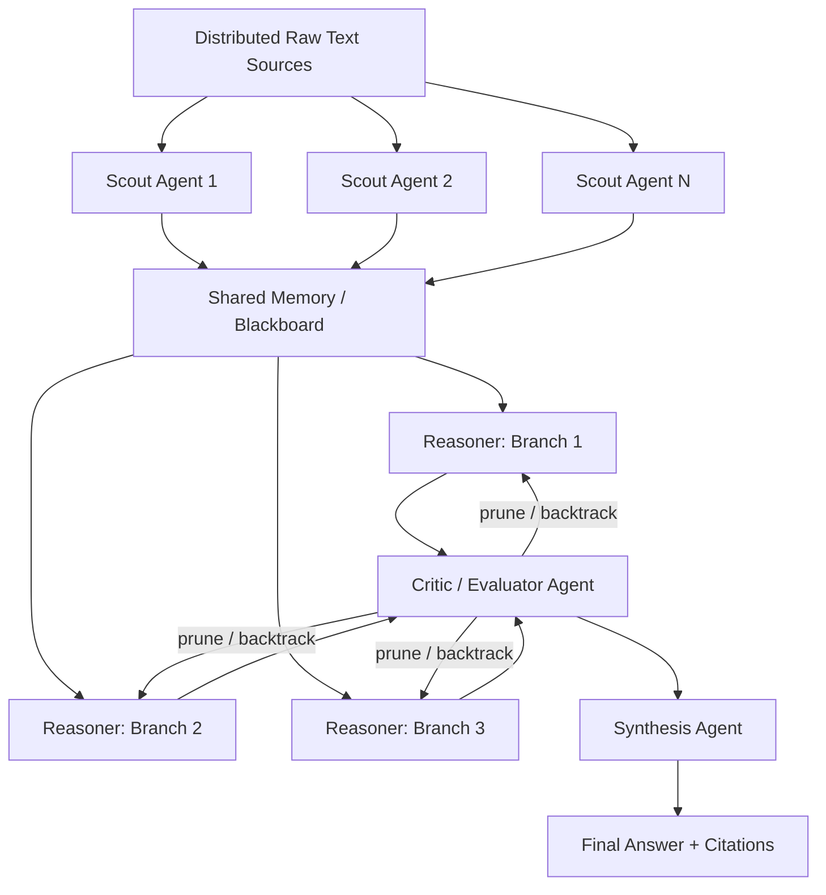
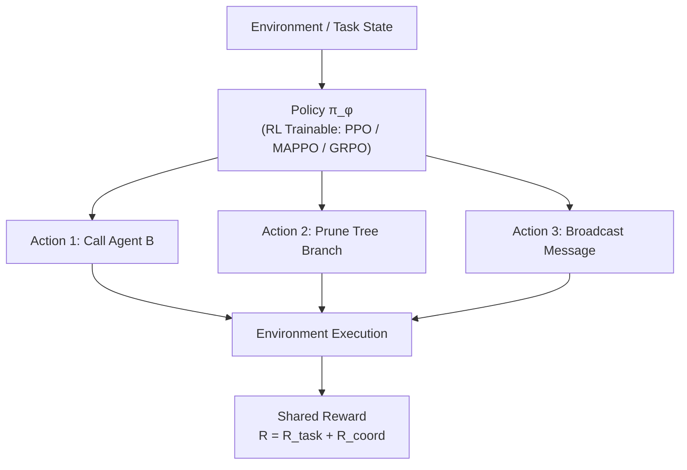

# Multi-Agent Tree-of-Thought Reasoning Framework — Project Blueprint

**Status:** Living design doc
**Last updated:** October 2026

---

## 1. Purpose

We are building an agentic framework (ReAct-style tool use, extended with Tree-of-Thought search) to study two things at once:

1. **Task performance** — can a team of agents correctly process a large, messy body of text and arrive at a well-supported decision?
2. **Cooperation quality** — do the agents actually collaborate well (share the right information, resolve conflicts, avoid redundant work), independent of whether the final answer is right?

This document records the system architecture, the RL/alignment framework, and the candidate problem domains. The full evaluation framework — all metrics, tiers, and the episode-history mechanism — now lives in its own doc: **[`EVALUATION.md`](EVALUATION.md)**, since it changes faster than the rest of this one.

---

## 2. System Architecture

### Agent roles

| Role | Count | Responsibility |
|---|---|---|
| **Scout / Extraction agents** | 3–5 | Each owns a distinct, non-overlapping slice of the raw text corpus. Extracts claims/facts and posts them to shared memory. **Deliberately given asymmetric information** — no single scout can solve the task alone. |
| **Reasoner agents** | 2–3 | Generate competing hypotheses (tree branches) from what's in shared memory. Extend, revise, or abandon branches as new evidence arrives. |
| **Critic / Evaluator agent** | 1 | Scores each branch, decides where to keep searching vs. prune, and can send reasoners back to re-derive a branch. |
| **Synthesis agent** | 1 | Has no raw documents — only what's been reported to it. Merges the winning branch into a final, cited answer. |

This role split is what makes cooperation *load-bearing*: if scouts don't communicate accurately, or the synthesizer misreads what reasoners actually agreed on, the system provably fails — cooperation isn't decorative.

The implementation (`tot_marl/`) is deliberately **flat rather than nested as subgraphs** — a LangGraph subgraph sharing its parent's exact state schema echoes back every field on its way out, which double-counts additive-reducer fields like `shared_facts`. Flattening sidesteps that gotcha.

---

## 3. Evaluation Framework

See **[`EVALUATION.md`](EVALUATION.md)** for the full breakdown: what we extract at each stage, the task decomposition, the three evaluation tiers (automatable / rubric-plus-judge / genuinely contested), the cooperation metrics (including ones borrowed from MultiAgentBench and the zero-cost-collaboration paper), the credit-assignment problem for the reward function, and the episode-history mechanism that records every pilot run so we can see whether metrics are actually moving over time.

---

## 4. RL Framework for Multi-Agent Learning

To train agents on *how to coordinate* — rather than retrain the LLM's world knowledge — we add a Multi-Agent Reinforcement Learning (MARL) layer at the orchestration/policy level, sitting on top of the Section 2 pipeline. The trainable object is the agents' communication and routing policy ($\pi_\phi$): which agent to call next, when to broadcast vs. stay local, when to prune a branch. The underlying LLM weights stay **frozen** (or get only light LoRA adapters).

### 4.1 Optimization algorithm: MAPPO vs. GRPO

| Algorithm | Mechanism | When to prefer |
|---|---|---|
| **MAPPO** | Centralized critic during training; decentralized actors at execution | Standard cooperative-MARL benchmark — needs centralized-training compute and a critic network |
| **GRPO** | No separate critic: sample *N* trajectories per task, optimize against the group-mean reward | Preferred when training compute is limited — current default plan, since dense per-step credit assignment isn't buildable yet (see EVALUATION.md's credit-assignment section) |

### 4.2 Reward function architecture

**R_total = R_task + R_efficiency + R_consensus** (implemented as stubs in `tot_marl/policy/reward.py`)

| Term | Definition | Status |
|---|---|---|
| R_task | +score if final answer matches ground truth | Needs real pilot-case outcomes — pending |
| R_efficiency | −α × LLM calls (tracked live via `state["llm_call_count"]`), or token-based once instrumented | Partially live — call-count tracked today |
| R_consensus | +γ when the Critic correctly prunes a bad branch early | Needs ground truth to verify "correctly" |

### 4.3 Recommended implementation libraries

| Library | Role |
|---|---|
| **TRL** (Hugging Face) | Applying PPO/GRPO over LM outputs and tool-calling decisions |
| **Ray / RLlib** | Distributed scaling of multi-agent environments once the pilot works |
| **EPyMARL / PyMARLzoo** | Sanity-checking algorithm choice before investing engineering time |

### 4.4 Where this fits

$\pi_\phi$ sits on top of, not inside, the pipeline: it decides orchestration moves — never the content of an agent's reasoning. That separation is what lets us keep the LLM frozen.

---

## 5. Candidate Problem Domain: Legal Research & Precedent Reasoning

Legal reasoning is close to an ideal fit: it's adversarial by nature (free information asymmetry), it branches into competing theories, it depends on citation accuracy (checkable), and outcomes are already decided and public.

**Open data sources:** [CourtListener](https://www.courtlistener.com) (opinions + citation-lookup API for hallucination checking), [Congress.gov API](https://api.congress.gov) (legislative history), [GovInfo.gov](https://www.govinfo.gov) (statutory text).

**Adversarial information split:** one scout gets plaintiff-framed facts, another defendant-framed facts, a third prior case law — genuine, non-synthetic conflicting framings, not a contrived disagreement.

---

## 6. Recommendation & Next Steps

1. Build out the real pilot set (10–15 already-decided cases) — this unblocks Tier 1 ground-truth metrics, the Oracle-Critic ablation, and the R_task/R_consensus reward terms.
2. Once real prompts are validated against a few real cases (not just the stub example case), begin logging enough episodes to make the trend report in `EVALUATION.md` meaningful.
3. Revisit `MAX_TOT_DEPTH` and `NUM_INITIAL_BRANCHES` as real hyperparameters to sweep once the pilot set exists, rather than fixed skeleton defaults.
4. Treat MAPPO/GRPO training as the step after the eval harness is trustworthy — reusing its signals as reward terms rather than building reward plumbing separately.

---

## 7. Appendix: Open Data Source Directory

- [CourtListener API docs](https://www.courtlistener.com/help/api/rest/)
- [CourtListener citation-lookup API](https://www.courtlistener.com/help/api/rest/citation-lookup/)
- [Congress.gov API](https://api.congress.gov/)
- [GovInfo bulk data & API](https://www.govinfo.gov/)
